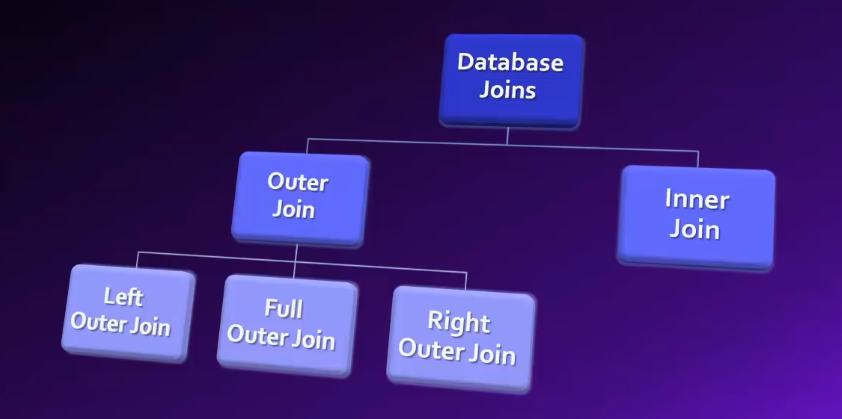

# Join

- `JOIN` can be faster than `SELECT` statements working across multiple tables.
- combines information from an operation of two tables. Returns a grid of columns
- The SQL `JOIN` clause is used to combine records from two or more tables in a database. A `JOIN` is a means for combining fields from two tables by using values common to each.
- joining two tables requires that they have some data in common, like sharing a column.
- Foreign keys are easy to spot an easy way to join on.
- you can join on any column, but when columns match it's easier.



**Inner Join**

- `JOIN` = `INNER JOIN` // treated same.
- most common. same as `WHERE` clause.
- only return records from both tables that match a condition.

```sql
-- Inner join only return matches
SELECT column_name1, column_name2
FROM table_1 AS t1, table_2 AS t2 -- including more than one table.
WHERE t1.deptId = t2.deptId

SELECT column_name FROM table_name1 JOIN table_name2 ON table1.column = table2.column;
SELECT t1.column_name FROM table_name1 t1 INNER JOIN table_name2 t2 ON t1.column = t2.column; -- same as JOIN.

SELECT date, avgprice, type FROM price
JOIN type ON price.typeid = type.typeid
WHERE type = 'organic' limit 10;
```

**Outer Join**

```sql
-- only return records for empNam and deptName where employee.departmentId matches department.departmentId
SELECT empName, deptName
FROM Employee AS E Department AS D
WHERE E.deptId = D.deptId
```

**Left Outer Join**

- return left table and results from right table.

```sql
-- return all empName column and only matching deptName.
SELECT empName, deptName FROM Employee E
LEFT OUTER JOIN Department D ON E.deptID = D.deptId

-- rows that do not have a match.
SELECT *
FROM Customers c
LEFT JOIN Order_History o -- Order_History AS o
ON c.id = o.id
WHERE o.id = NULL; -- everything that does not match o.id.
```

**Right Outer Join** // opposite of left join.

- return full right table with results from left.
- some DBMS don't recognize right join, because you can do `LEFT JOIN` and switch table_names and get same results.

**Full Outer Join**

- return all records from both tables.

## Union

- see results from two or more different SELECT statements.
- results stack vertically instead of horizontally.
- first column of first SELECT statement will line up with first column of second SELECT statement.
- rules
  - the number of columns returned must be the same.
  - data types must match in each column.

```sql
SELECT customerId, firstname, lastname
FROM Customers
UNION
SELECT customerId, firstname, lastname
FROM VIP_Customers;
```
