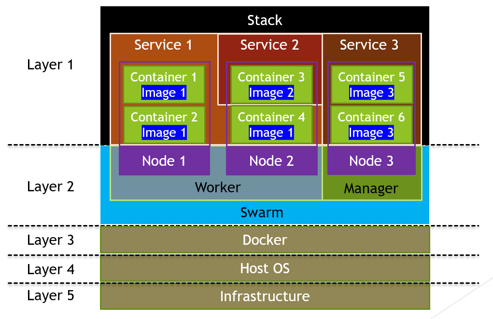

# Docker

- docker creates isolated containers.

- doesn't provision hardware to container. It connects directly to the
  os

  - virtual machine connects directly to the kernel, so it need os,
    drivers, dedicated resources are provisioned.
  - needs a guest host.

- don't need system resources. can run hundreds of containers on single
  machine.

About

- docker images are built into containers.

  - The 'Dockerfile' allows complex build instructions for making custom
    images.
  - The docker-compose file allows for single or multiple containers to
    be started with attributes: ports, environment variables, name...
    from images.

Install

- <https://www.digitalocean.com/community/tutorials/how-to-install-and-use-docker-on-ubuntu-20-04>

```sh
#! /bin/bash

# Remove old docker versions
sudo apt remove docker docker-engine docker.io

sudo apt-get install apt-transport-https ca-certificates curl software-properties-common -y

curl -fsSL https://download.docker.com/linux/ubuntu/gpg | sudo apt-key add -

sudo add-apt-repository "deb [arch=amd64] https://download.docker.com/linux/ubuntu $(lsb_release -cs) stable"

sudo apt-get update

apt-cache policy docker-ce

sudo apt-get install docker-ce -y

# docker compose
sudo apt-get install docker-compose-plugin


# avoid typing 'sudo' to run docker
sudo usermod -aG docker ${USER}
newgrp docker  # reloads groups so you don't have to logout and back in.
docker compose version
docker run hello-world  # check if docker runs without sudo
```

**Tutorial -overview**

- <https://betterprogramming.pub/how-to-differentiate-between-docker-images-containers-stacks-machine-nodes-and-swarms-fd5f7e34eb9f>



- A container is the smallest unit of the entire Docker architecture.
  Before a container is launched, it is called as an image. According to
  the definition provided in Docker Documentation, an image is an
  executable package including everything that’s required to run an
  application, from application codes, to runtime, libraries, environment
  variables, and configuration files. A container is a runtime instance of
  an image.

**Services**

- In a distributed application, different pieces of the application are
  called “services”.

- For instance, an attendance web application normally contains different
  types of services, like the front-ends interacting with the users, the
  back-ends processing the inputs from the users and storage storing the
  user data.

- A service only runs one type of image. A single container running in a
  service is called a task. Refer to the diagram above — the containers
  under the same service are running the same image, or performing the
  same functionality. A service codifies an approach of how the image
  should be running, like the port’s numbers and the number of replicas of
  the containers. Scaling up a service will increase the number of
  containers in a service, leading to high throughput of that particular
  service.

- The containers in a service are not necessarily all located on the same
  node. According to the diagram above, there are three containers
  deployed under Service 1, two of the containers are located on Node 1
  and another is located on Node 2.

**Stack**

- According to the definition provided in Docker Documentation, a stack is
  a group of interrelated services that share dependencies and can be
  orchestrated and scaled together. Referring to the diagram above, there
  are three services under a single stack. A single stack is capable of
  defining and coordinating the functionality of an entire application —
  unless the application is highly complex and needs to be split into
  multiple stacks.

**Version**

- docker version

**Terms**

- Dockerize it
  -add 'Dockerfile' to project, so it will run in a docker container.

- Dockerfile
  - instructions to docker on how to build our application.
- Docker Image
  - image files, similar to CLASS object and inheritance. The container is the instance of these.
  - Image is a template for creating an environment of your choice.
- Docker Container
  - the running instance of the image. Each container can be in a different state.
- Package tool
  - apt (advanced package tool)

### Docker Hub

- [_https://hub.docker.com/_](https://hub.docker.com/)
- [_https://hub.docker.com/search?q=node_](https://hub.docker.com/search?q=node)
- node:alpine //which linux distro you want.
- docker login
  - docker build . -t bryonsmith/node-helloworld:v1 //if you leave tag off will default to 'latest'
- docker push bryonsmith/node-helloworld:v1

- `docker build -t alexellis2/href-counter:latest .`
- `docker build --target builder -t alexellis2/href-counter:latest .`

  - stop on builder and tag it.

- **filter**
  - `docker images --filter “label=builder=true” --format '{{.CreatedAt}}\t{{.ID}}' | sort -nr | head -n 1 | cut -f2`
  - `docker rmi \$(docker images --filter=label=builder=true -q)`

**external image as a stage**

```dockerfile
COPY --from=nginx:latest /etc/nginx/nginx.conf /nginx.conf
```

Dockerfile ssh //do not use '\~'

```dockerfile
FROM ubuntu:latest

RUN apt-get update; \
    apt-get install openssh-server passwd net-tools -y; \
    mkdir -p /root/.ssh
WORKDIR /root/.ssh
COPY ./.ssh/id_rsa.pub ./authorized_keys
RUN chmod 600 ./authorized_keys

ENTRYPOINT service ssh restart && bash
```

- `docker build -t test1 .`
- `docker run -it --rm -dp 8080:80 -p 22:22 --name bob test1 /bin/bash`
- `ssh -i .ssh/id_rsa root@localhost`

# CMD Line Arguments

- <https://docs.docker.com/engine/reference/commandline/image_rm/>

**Help**

- docker run --help //show run options.

**Format**

- `ID\t{{.ID}}\nNAME\t{{.Names}}\nImage\t{{.Image}}\nPORTS\t{{.Ports}}\nCOMMAND\t{{.Command}}\nCREATED\t{{.CreatedAt}}\nSTATUS\t{{.Status}}\n`

**Flags**

- `-a` // all list containers running or not running.
  - `docker ps -a` (same as `docker container ls`)
- `-d` // detached mode -run in background
- `-f` // `docker build --target web -t ngx . -f ./e-commerce-frontend/Dockerfile` // don't forget the period.
- `-it` // run interactive mode (take you inside the container)
- `-p` // **port:map** 80:80 host (your computer port) port : 80 mapped to container port 80
  - `docker run -dp 80:80 image`
  - multiple ports: `docker run -d -p 80:80 -p 8080:80 nginx:latest`
- `--name` // `docker run --name bob`
- `-q` // only return image name.
- `--rm` // remove container when exit.
- `-t` // tag. can be anything. identifies
  - `docker image` // `docker build -t`
- `-v` // volume `docker run -v yourDirectory:dockerDirectory`
  - You must store the data under `$HOME/docker/volumes/` if you’re using Mac or Linux, and `C:\ProgramData\docker\volumes` if you’re on Windows.
- `-w` // watch folder

**Docker Commands**

```sh
# list all containers running or not
docker ps -aq # a=all q=only return image name.

# stop all running containers
docker stop $(docker ps -aq)
# remove one image
docker image rm -f IMAGE
# remove one container
docker container rm NAME

# Remove all images, containers
# remove all containers not running.
docker rm $(docker ps -aq)
# remove all images not running
docker rm $(docker images -q)
# delete all images running and not running
docker rmi -f $(docker images -q)
docker rm -f $(docker ps -aq)

# Prune
# remove all orphaned layers
docker rmi -f $(docker images -f "dangling=true" -q)
# prune -remove all images and containers that are not running.
docker system prune -af


# Remove Volume
docker volume remove VOLUME_NAME

#  Run
# combines docker pull and start. Create new container from an image and start it.
docker run -dp6000:22 -it --rm --name bob IMAGE_NAME
docker run -d -it --rm --name flaskapp -p5000:5000 bob/flaskapp-demo:v1
docker run --rm -dp 5005:5005 . \< Dockerfile
docker run -it --rm -dp 8080:80 -p 22:22 --name bob test1 /bin/bash

# Start
# for working with containers, not the images. The container will contain all attributes of when it was created. <https://docs.docker.com/engine/reference/commandline/start/>
docker start NAME
docker run -it --entrypoint=/bin/bash NAME # -it = interactive -keep it running.

# Stop Container
docker stop IMAGE_NAME
```

**Containers / Images**

- <https://docs.docker.com/engine/reference/commandline/image/>
- all data is gone when you close docker container. Volumes allow you to
  have persistency.

- **ATTACH**
  - sudo docker attach container_Name
  - The attach command can only connect the host streams to those of the command defined as ENTRYPOINT or CMD in the container.
- **Build/Rebuild Image**

  - name/digest
    - mongo**@sha256**:5255f45e7f87b4404388205351ef69e5f6c018976b355729afa01014faf7792a
  - **remove image**
    - `docker image rm [options] image`
  - <https://docs.docker.com/engine/reference/commandline/build/>

- **commit**

  - <https://www.digitalocean.com/community/tutorials/how-to-install-and-use-docker-on-ubuntu-20-04>
  - changes to container can be saved as an image.
  - `docker commit -m "What you did to the image" -a "Author Name" container_id repository/new_image_name`

- **EXEC**
  - <https://docs.docker.com/engine/reference/commandline/exec/>
  - `docker exec \[options\] \[container\] \[command\]` // get docker container terminal.
  - `docker exec -it 9274f8bb0994 /bin/bash` // sometimes only `/bin/sh` works.
- **Logs**
  - `docker logs NAME -f` // stream logs
  - `docker logs CONTAINER-ID/NAME` // show all things that have been output to console.
- `--mount` // options are key-value pairs. Each pair is formatted like this: key=value, with a comma between one pair and the next. Common options:
  - `type` // mount type. Options are bind, volume, or tmpfs. We’re all about the volume.
  - `source` // source of the mount. For named volumes, this is the name of the volume. For unnamed volumes, this option is omitted. The key can be shortened to src.
  - `destination` // the path where the file or directory is mounted in the container. The key can be shortened to dst or target.
  - `readonly` // mounts the volume as read-only. Optional. Takes no value.

```dockerfile
 docker run --mount type=volume,source=volume_name,destination=/path/in/container,readonly my_image
```

- **Network**

```sh
# show all internal networks
docker network ls
# delete network https://docs.docker.com/engine/reference/commandline/network_rm/
docker network rm NAME
# create new network items can communicate on.
docker network create NAME
docker network create --subnet 172.20.0.0/16 NAME
docker network inspect NAME
docker network connect --ip 172.20.0.5 NETWORK-NAME CONTAINER-NAME
docker network connect NETWORK-NAME CONTAINER-NAME
docker -d --name jenkins -p 8080:8080 -p 5000:5000 -v --network minikube jenkins/jenkins:lts

# example to run mongodb container on custom network.
docker run -d \
-p 27017:27017 \
-e MONGO_INIT_ROOT_USERNAME=admin \
-e MONGO_INITDB_ROOT_PASSWORD=password \
--name mongodb \
mongo  # mongo is the image name.
```

- **Pull**
  - pull image from repo to computer.
  - `docker pull IMAGE`
- **Rename**
  - `docker rename CONTAINER_NAME_OR_ID NEW_NAME`
- `--user | -u`
  - `docker run -u 1000 my_image` // create user at runtime
  - Choose a userid over 500 to avoid running as a default system user.
- **View Images**
  - `docker images | docker image ls`
    - if you see `none:none` those are orphaned images, prune it.
      - `docker rmi -f $(docker images -f "dangling=true" -q)`
    - `docker images -a` // show images that build the layers of os you downloaded. intermediate images.
      - `none:none` is ok here.
- **Volumes** `-v | --volume` // `host:pwd`
  - <https://docs.docker.com/storage/volumes/>
  - `docker run -it --rm -v ${PWD}:/work -w /work --entrypoint /bin/sh amazon/aws-cli:latest`
    - everything in `PWD` will be copied to work folder on docker
    - `-w` watch folder for change
    - can be used with docker-compose and cmd line. Volumes are not available in Dockerfile. Because Dockerfile is made for creating images and can run anywhere, volumes should only exist at runtime.
  - allow sharing between host and container. And between containers.
  - allow data to persist.

```sh
# host:container // can leave off read-only if you want to edit.
docker run --name some-nginx -v /some/content:/usr/share/nginx/html:ro -d nginx
# to map to another container
#1st container
docker run --name website -v /local/folder:/usr/share/nginx/html -dp 8080:80 nginx
# 2nd container
docker run --name website-copy --volumes-from website -dp 8081:80 nginx # this will be linked to volume of website.
```

# Pipeline Steps

1. **build image**

```sh
# if Dockerfile is in same folder
docker build -t userName/repoName:tag .
# don't forget the '.'
docker build -t userName/repoName:tag -f ./docker/Dockerfile.build .
docker build -t userName/repoName:tag . < Dockerfile
docker build -t bryonsmith/flaskapp-demo:v1 . < Dockerfile
docker build --target builder -t alex/ho:v1 .
# curl
curl example.com/remote/Dockerfile | docker build -f - .
```

2. **push image**

```sh
docker push userName/repoName:tag
docker push bob/flaskapp-demo:v1
```

3. **login**

```sh
# jenkins cred : cred / username/password / id: dockerhublogin
# jenkins pipeline docker hub login
echo $DOCKERHUB_CREDENTIALS_PSW | docker login -u $DOCKERHUB_CREDENTIALS_USR --password-stdin
```

```groovy
//  pipeline
environment {
    DOCKERHUB_CREDENTIALS=credentials('dockerhublogin')
}
```
