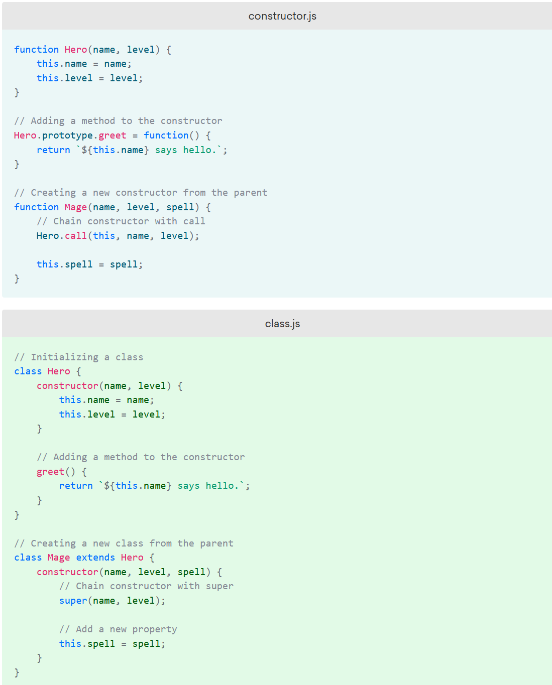

# Classes

[Classes Intro](https://www.digitalocean.com/community/tutorials/understanding-classes-in-javascript)
[Complete Guide](https://dmitripavlutin.com/javascript-classes-complete-guide/)

- <https://javascript.info/class>
- <https://developer.mozilla.org/en-US/docs/Web/JavaScript/Reference/Classes>
- always in `strict mode`
- First letter is capitalized to identify constructor.
- The JavaScript language has nine built-in constructors: Object(), Array(), String(), Number(), Boolean(), Date(), Function(), Error() and RegExp().

**Object Literals**

- When creating values, we are free to use either `object literals` or `class constructors`. However, object literals are not only easier to read but also faster to run, because they can be optimized at parse time. Thus, for simple objects it’s best to stick with literals.
- What’s more interesting is that it’s still possible to call methods on literals. When a method is called on a literal, JavaScript automatically converts the literal into a temporary object so that the method can perform the operation. Once the temporary object is no longer needed, JavaScript discards it.

# New

- The Keyword **new** determines whether or not a function is a constructor.
- The `new` keyword creates a new object with the (class / functions ) properties and methods. It then binds`this` to the `object`.
- methods are not copied when you `extend` or call `new`. The are added as the prototype.
- Missing the new keyword creates the variables on the `Global/Window object` which can be accessed from anywhere. It’s important to remember to use the `new` keyword before all constructors. If you accidentally forget `new`, you will be modifying the global object instead of the newly created object.
  - When we call the a function constructor without new, we are in fact calling a function without a return statement. As a result, **this** inside the constructor points to `Window (global)` (instead of myBook), and two global variables are created. However, when we call the function with `new`, the context is switched from global (Window) to the instance. So, **this** correctly points to myBook.
- Note that in **strict mode** this code would throw an error because strict mode is designed to protect the programmer from accidentally calling a constructor without the new keyword.

# Prototypes

- If you change the property of a linked prototype, all linked objects will get the change.
- All prototypes will be assigned to the `new` instantiated object.
- `Name.prototype.functionName = function(){}` will be added to all `new` objects, even if they were created before function was added.

**Object based Constructors**

```ts
// Get or set prototype
Object.getPrototypeOf(obj);
Object.setPrototypeOf(obj);
// immutable Constructor object
const Greeter = Object.freeze({
  init: function (phrase) {
    return Object.assign({}, this, { phrase });
  },
  greet(name) {
    // new way to write method!!!!
    return this.phrase + name;
  },
});
const sayHello = Greeter.init('Hello ');
const sayGoodMorning = Greeter.init('Good Morning ');
console.log(sayHello.greet('John')); // Hello John
console.log(sayGoodMorning.greet('John')); // Good Morning John
```

# Constructor

- if you don't create a constructor, an empty one is created for you.
- [_https://css-tricks.com/understanding-javascript-constructors/_](https://css-tricks.com/understanding-javascript-constructors/)
- Create **Safe Constructor** with `new` keyword checking:
  - The if statement checks if object is tied to the 'this' keyword, if not, it ties it to the object.
- Classes are imperative OOP. The 'this' keyword is used to assign the
  object to the method.
- Classes are blueprints of an object with values and methods.
- Classes are not hoisted
- Classes are functions
- Only add methods to classes and not properties.
- Do not use arrow function. Does not bind 'this'.
- [_https://www.javascriptjanuary.com/blog/es6-classes_](https://www.javascriptjanuary.com/blog/es6-classes)
- [_https://medium.com/@robertgrosse/how-es6-classes-really-work-and-how-to-build-your-own-fd6085eb326a_](https://medium.com/@robertgrosse/how-es6-classes-really-work-and-how-to-build-your-own-fd6085eb326a)
- [_https://medium.com/@luke_smaki/javascript-es6-classes-8a34b0a6720a_](https://medium.com/@luke_smaki/javascript-es6-classes-8a34b0a6720a)
- [_https://medium.com/@PitaJ/javascript-inheritance-patterns-179d8f6c143c_](https://medium.com/@PitaJ/javascript-inheritance-patterns-179d8f6c143c)
- [_https://medium.com/javascript-scene/the-two-pillars-of-javascript-ee6f3281e7f3#.5zt7hdohc_](https://medium.com/javascript-scene/the-two-pillars-of-javascript-ee6f3281e7f3#.5zt7hdohc)
- [_https://www.freecodecamp.org/news/a-complete-guide-to-creating-objects-in-javascript-b0e2450655e8/_](https://www.freecodecamp.org/news/a-complete-guide-to-creating-objects-in-javascript-b0e2450655e8/)
- [_https://medium.com/@parsyval/javascript-prototype-vs-class-a7015d5473b_](https://medium.com/@parsyval/javascript-prototype-vs-class-a7015d5473b)
- ES6
- [_https://medium.com/beginners-guide-to-mobile-web-development/super-and-extends-in-javascript-es6-understanding-the-tough-parts-6120372d3420_](https://medium.com/beginners-guide-to-mobile-web-development/super-and-extends-in-javascript-es6-understanding-the-tough-parts-6120372d3420)
- [_https://overreacted.io/why-do-we-write-super-props/_](https://overreacted.io/why-do-we-write-super-props/)
- [_https://overreacted.io/how-does-react-tell-a-class-from-a-function/_](https://overreacted.io/how-does-react-tell-a-class-from-a-function/)
- Extend  the  Person6  class // extend means subclass

```ts
class Home {
  name: string;
  constructor(name: string) {
    this.name = name;
  }
}

//  ES5  Function Constructor.
const Person = function (firstName, lastName, age) {
  this.firstName = firstName;
  this.lastName = lastName;
  this.age = age;

  //'this' not needed because arguments exist in constructor.
  this.name = () => firstName + ' ' + lastName;

  // will add a new property 'isSleeping = true' on object when called.
  this.sleep = () => (this.isSleeping = true);
};

// add new method 'getBio' to Person Constructor.
Person.prototype.getBio = function () {
  return `${this.firstName}  is  ${this.age}.`;
};

// add new property to Person Constructor and assigning it a value.
Person.prototype.location = 'Thailand';
const me = new Person('Bob', 'Jones', 24); //  {  firstName:  "Bob",  lastName:  "Jones",  age:  24  }
console.log(me.location); //  Thailand
const anotherMe = new Person('Clancey', 'Turner', 33); //  {  firstName:  "Clancey",  lastName:  "Turner",  age:  33  }
console.log(anotherMe.location); //  Thailand

// Overwrite Main prototype constructor:
Person.prototype.getBio = function () {
  return 'Test  1';
};

// me.getBio() returns'Test 1'. This changes all getBio objects made from this constructor. This is because everything is linked to the same object prototype.
```

# Super

- <https://medium.com/beginners-guide-to-mobile-web-development/super-and-extends-in-javascript-es6-understanding-the-tough-parts-6120372d3420>
- super() is a function inside the 'constructor' method. It passes the child arguments to the parents params.
- Inside a .constructor() method, you must call the super-constructor via `super()` before you can access **'this'**. That’s because `this` doesn’t exist before the super-constructor is called (this phenomenon is specific to classes).
- super is superclass: the parameters come from the parent class.
- Super is equivalent to `ParentConstructorName.call(this, …args)`
- super() can also be used as an 'object' in the child refering to the parent class explicity: **super.someParentMethod()**

**variables are add inside the constructor fn.**

```ts
// typescript
export class Product {
  title: string;
  public uuid: string;
  private fileExist: boolean;
  constructor(title: string) {
    this.title = title;
    this.uuid = randomUUID(); //extra variables
    this.fileExist = false; //extra variables
  }
  // All the methods below will be added to the prototype.
  // Typescript allows you to create variables outside of the constructor, but it is good practice to create properties inside the constructor function.
}

class Images extends Product {
  constructor(title) {
    super(title); // must be called before any other properties.
  }
}
```

# Extends

- anything inside the 'constructor fn' is copied to the child. All other items are added through the prototype chain.
- **pros**
  - keeps code organized, good for many small linking objects
- **cons**
  - tightly coupled

# Properties

**Function Constructor vs Class Constructor**

- <https://www.digitalocean.com/community/tutorials/understanding-classes-in-javascript>



**static methods**

- can be called off the class itself, not the Instance.

```js
class Person {
  static name = 'bryon';
}
Person.name; //bryon
const person = new Person();
console.log(person.name); //undefined
```

**public**

- default. Can be accessed from anywhere.
- <https://developer.mozilla.org/en-US/docs/Web/JavaScript/Reference/Classes/Public_class_fields>

**private**

- can only be accessed from the class itself.
- `_hash() {}` // the underscore mean leave alone.
- `__propertyName` naming convention for private properties that shouldn't be directly manipulated.

**protected**

- can be accessed from itself and child classes.

```ts
// getter  -sometimes know as an accessor.
class MyGetter {
  arr = [1, 2, 3];
  get length() {
    return arr.length();
  }
}
const getter = new MyGetter();
// don't have to call it like a method, because added 'get' to it.
getter.length; // 3

class Point {
  x: number;
  y: number;
  constructor(x: number, y: number) {
    this.x = x;
    this.y = y;
  }
  add(point: Point) {
    return new Point(this.x + point.x, this.y + point.y);
  }
}
var p1 = new Point(0, 10);
var p2 = new Point(10, 20);
var p3 = p1.add(p2); // {x:10,y:30}

class Point3D extends Point {
  z: number;
  constructor(x: number, y: number, z: number) {
    super(x, y);
    this.z = z;
  }
  add(point: Point3D) {
    var point2D = super.add(point);
    return new Point3D(point2D.x, point2D.y, this.z + point.z);
  }
}
```

**Class Constructor Best Practices**

- extend is subclass: takes on all the properties and methods of parent.
- <https://medium.com/javascript-in-plain-english/learn-javascript-functional-programming-from-avengers-36fc40fca7ab>
- <https://medium.com/better-programming/4-dangerous-problems-in-javascript-easily-solved-by-the-builder-design-pattern-7f0eb5b4455c>

```js
class FrogBuilder {
  constructor(name, gender) {
    this.name = name;
    this.gender = gender;
  }
  setEyes(eyes) {
    this.eyes = eyes;
    return this;
  }
  setWeight(weight) {
    this.weight = weight;
    return this;
  }
  setHeight(height) {
    this.height = height;
    return this;
  }
}
const myFrog = new FrogBuilder('bob', 'male').setEyes('blue').setWeight(185);
```
