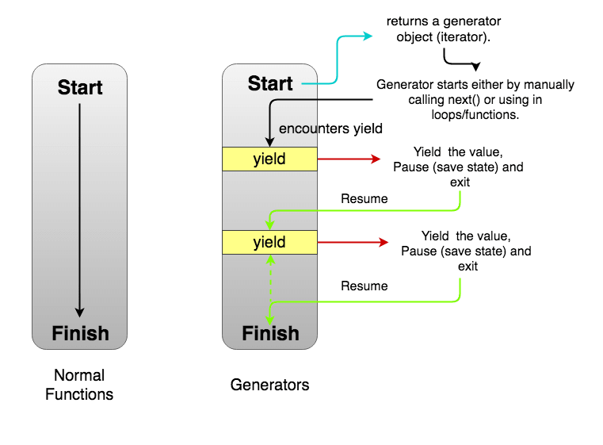

# Generators

- <https://dev.to/muqsitadam/javascript-generators-a-beginners-guide-1ojf>
- Generators are functions that can be exited and later re-entered.
- [MDN](https://developer.mozilla.org/en-US/docs/Web/JavaScript/Reference/Statements/function*)



```ts

```
