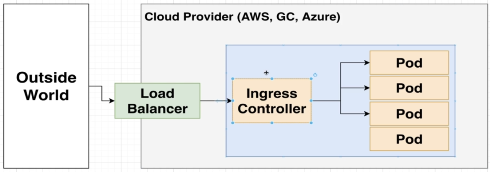
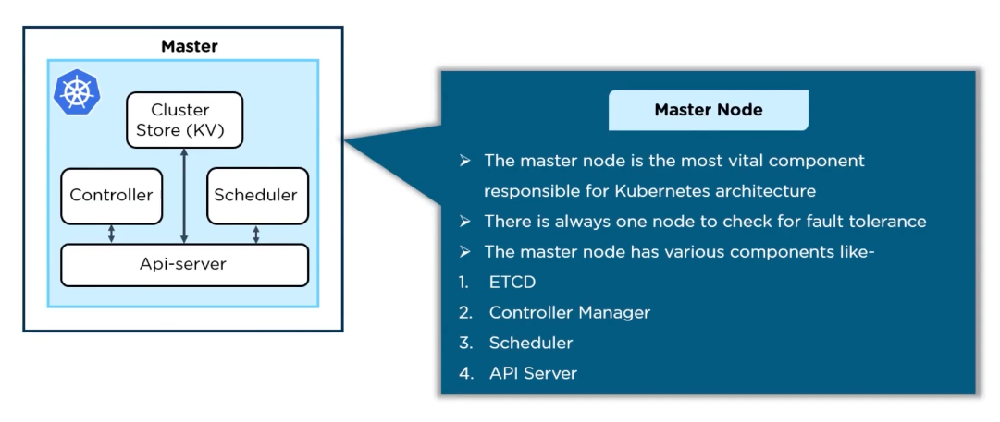
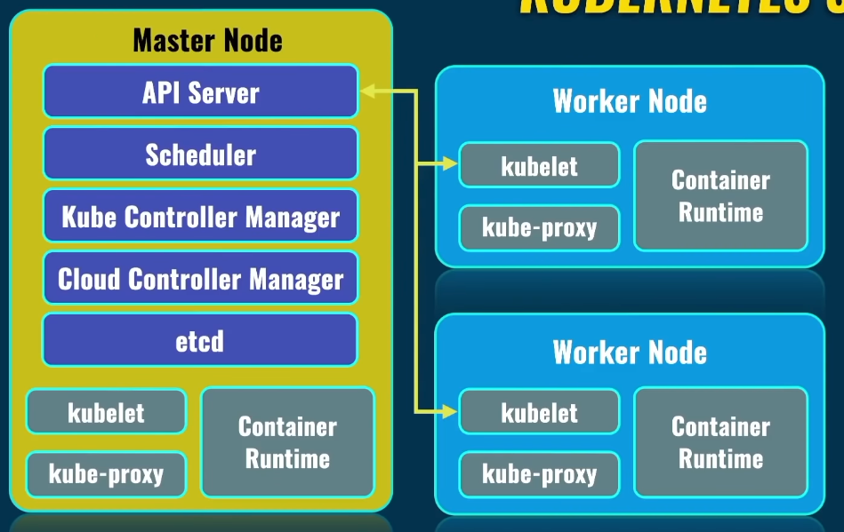
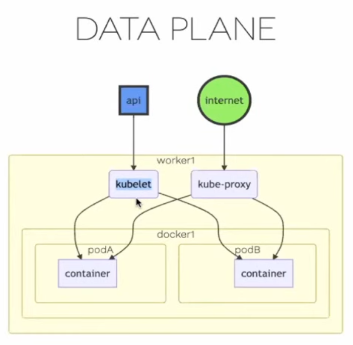

Kubernetes (K8s)

- **Container Orchestration tool** that allows us to declare: what is
  the end state we want. It uses it's own built in logic to make that
  happen in the most efficient way possible.
  - describe this is what it should look like when it's done, then the orchestrator figures out how to get there.
- Kubernetes manages containerized deployments.
- Next level maturity of deployment.
  - better than you deploying to cloud yourself manually.
- a solution to maintain and update servers without interrupting other services
- commands and **controls infrastructure.**
  - vagrant setup infrastructure, ansible control infrastructure.
- allows you to swap to different platforms: (azure, aws, google cloud, ...) and do things the same way because you use kubernetes.
- ansible for your cloud operations.
- terraform is the vagrant for cloud services.
- when you go from monolith to microservices, you need a way to manage it.

**pros**

- inherently secure
- portable
- less time to use.

**Linux setup**

- <https://kubernetes.io/docs/tasks/tools/install-kubectl-linux/#install-using-native-package-management>

**AWS ec2**

- <https://docs.aws.amazon.com/eks/latest/userguide/install-kubectl.html>

```sh
curl -o $HOME/kubectl https://s3.us-west-2.amazonaws.com/amazon-eks/1.23.7/2022-06-29/bin/linux/amd64/kubectl
chmod +x $HOME/kubectl
mkdir -p $HOME/bin && cp $HOME/kubectl $HOME/bin/kubectl && export PATH=$PATH:$HOME/bin
echo 'export PATH=$PATH:$HOME/bin' << ~/.bashrc
kubectl version --short --client
```

**Info comic**

- <https://cloud.google.com/kubernetes-engine/kubernetes-comic>

# About

1.  Pod is made up of an Image turned into a docker container. Each pod is ephemeral.
    1.  Each pod will have deployment.yaml.
    2.  Each pod is assigned it's network by the service.yaml.
2.  Node can host one or more pods.
3.  Cluster is a group of nodes under the control of the master node.
    1. Infinite number of nodes can be managed by the master branch.

# Definition

**Annotation**

- label with much larger data capacity. It is used for storing data that is not searched but is required by the resource.

**ConfigMap**

- external configuration of your application. when node internal communication between pods changes, you use configmap to map to correct pod. (when you have a database and server )

**Control Plane**

- <https://kubernetes.io/docs/concepts/overview/components/>
- encompasses the master worker, which can be multiple machines acting as the controller.
- includes the 4 items in the master worker

**Container**

- docker container image

**Cluster**

- <https://kubernetes.io/docs/concepts/services-networking/ingress/#terminology>
- Cluster: A set of Nodes that run containerized applications managed by Kubernetes.
- control plane with at least one worker node.
- collection of servers (physical or virtual) on which applications are managed and run
- group of nodes (physical or virtual machine) - overseen by the master node
- has namespaces: to section of what has access to what.

**DaemonSet**

- Implements single instance of pod on worker node.

**Data Plane**

- worker nodes do the work. container images run via pods.

**Deployment**

- blueprint for each cluster/node setup.
- describes how app should got out or scroll back.
- abstraction layer over the pods that you interact with.
- layers of abstraction
  - deployment manages 'replicaset'
  - replicaset manages pods
  - pod manages docker container
- everything below deployment is managed by k8s.
- CRUD happens on the deployment level.

**Desired State**

- once kubernetes reaches the state you have described in the Deployment
  doc.

**Ingress**

- <https://kubernetes.io/docs/concepts/services-networking/ingress/>
- how to pass information inside the cluster: ssh, ssl..., has routing rules to know where traffic should go.
- give node a domain name: [http://myapp.com](http://myapp.com/) instead of [http://123.245.0.1:8080](http://123.245.0.1:8080/)
- ingress does the forwarding of request to 'service'
- load balancer end points.
- <https://kubernetes.github.io/ingress-nginx/>

**Ingress Controller**

- [ingress-nginx](https://kubernetes.github.io/ingress-nginx/deploy/)-
- ingress controller is a pod or group of pods in your node that manages ingress rules.
- evaluate all the rules. manage re-directions.
- `kubectl apply -f https://raw.githubusercontent.com/kubernetes/ingress-nginx/controller-v1.5.1/deploy/static/provider/cloud/deploy.yaml`



**Job**

- pod runs, completes, then goes away.

**Kubelet**

- Kubelet is the technology that applies, creates, updates, and destroys
  containers on a Kubernetes node.
- every node even master has kubelet.

**Labels**

- key-value pairs that attach to objects, such as pods. The key-value
  pairs can filter, organize and perform operations on resources.

**Load Balancer**

- single endpoint to internal cluster.
- handles communication in a way the spreads things evenly.
- Load Balancer Port

  - open port to talk to enter
    Master Worker Node (control
    plane)

- control worker nodes
- make up the control plane of Kubernetes. Includes scheduling and
  events.
- most vital component.
- 4 processes run on every master node

1. **API Server**
   1. one entry point into master server.
   2. deploys new cluster; cluster gateway; gatekeeper for authentication - only authorized request get through to cluster
2. **Scheduler**
   1. authenticated api server messages are passed to scheduler.
   2. deicides where best to install new pod
   3. process that **makes the pod is the kubelet service** on the node itself.
   4. **Kubelet**is the technology that applies, creates, updates, and destroys containers on a Kubernetes node.
   5. assigns task to worker nodes. Tracks workload and distributes.
   6. re-schedule/re-start pod
3. **Controller Manager**
   1. detects state change, (when pods die)
   2. makes request to scheduler to re-schedule pod replacement. Scheduler
   3. picks best node for job and request kubelet running on that node to rebuild the pod.
   4. REST api server using ssl
   5. when pods die, re-spowns new pod
4. **ETCD** (Cluster Store)
   1. key value store: cluster brain. all changes in cluster get recorded and saved in the ETCD.
   2. all state data about the clusters is stored here.
   3. application data is not stored here.
   4. manages details and values
   5. when multiple masters are used, api process is load balanced and ETCD is distrubted across all masters.
   6. the work load on masters is less, because worker nodes do the bulk of the work.
      

**Name**

- what resource is called

**Namespace**

- creates isolated clusters on your node.
- provides additional qualification to a resource name
- kubectl get namespace
  - kube-system
    - not for your use.
    - system processes
  - kube-public
    - publicly accessible data
    - cluster info
      - kubectl cluster-info //show connection data
  - kube-node-lease
    - heartbeats of nodes
  - default
    - your namespaces you create.
- cannot share configmap or secrets across namespace clusters
- can share service
- each pod inside of node will share same namespace by default.

**Node** (sometimes called worker node)

- physical or virtual machine that run one or more pods
  **Each node has:**

1. container-runtime (docker, cri-o, containerd)
   1. kubelet
      1. talks to container-runtime (cri-o, docker, containerd) and node.
      2. assigns resources to pod (cpu, ram, ...)
      3. kublet is the kubernetes agent on the control plane.
2. kube-proxy
   1. the service that is responsible for conveying information to and from the control plane and between pods.
   2. forward all request
   3. groups of pods -see clusters
   4. services/processes must be installed on every node (worker node, because it does the work)
3. docker container runtime needs to be installed on every node
   1. kublet needs to be installed. It interacts with both the container and node.
   2. kublet starts the pod and assigns resources from node hardware.
4. kube-proxy routes/forwards all request in an efficient manner to correct pod. kube-proxy takes the node port facing internet traffic, then routes to pod port.

**NodePort**

- create tunnel from node to pod. //has range: 30,000-32,767

**Pod**

- smallest unit in kubernetes. layer on top of the docker container.
- when you think of how to structure your pod, how do I scale them? do I scale the containers together? or independently? when you always scale pods together, they should be in one pod together.
- you do not usually work with the pods. The abstraction layer over pods is called: 'Deployment'
- a layer of abstraction on top of docker containers. allows K8s to control docker containers.
- allows you to only have to interact with the kubernetes pod, and it controls the docker container.
- each pod gets own internal ip address. pods are ephemeral: can die easily.
  - each pod that dies, will be assigned a new ip address. 'service' options allows you to keep communication with new pod.
- can have one or more docker container inside. Kubernetes only sees the pod.
- pods are ephemeral, they can be deleted and moved to another node at any time.
- can have multiple containers: share volumes, share ip address, share namespace of pod
  - only tightly-coupled containers should be in the same pod.
- Debugging
  - kubectl logs podNameFromGetPod //will show pod logs.

**Replication Controllers**

- define pod life-cycles

**Replications Sets**

- ensures a defined number of pods are always running.
- how many replicas of each pod will be running and manage and replace pods when they die.
- layer between deployment and pod. deployment -\> replicaset -\> pod -\> docker

**StatefulSet**

- the concept of db server replication, two or more db servers talking
  to database will loose state. StatefulSet keeps database in sync with multiple db servers talking to database.
- this process is difficult and advises deploy db server from dedicated database platform and just talk to db server.

**Secret**

- keep credentials mapped to variable, so when credentials change, pod map to variable still works. stores credentials in base64 encoded format. similar to 'configmap'.
- connect it to your pod, so it can see secrets

**Selector**

- expression that matches labels to filter specific resources

**Service**

- internal network between pods and outside port.
- abstraction on top of pods which provides a single IP address and DNS by which the pods can be accessed.
- maps a fixed ip address to a logical **group **of pods. //pods can be on different nodes.
- each pod will have it's own internal ip address, when dies, new address will be assigned. Service abstracts this away so you don't have to worry about the ip address changing to communicate with pod.
- service is a static ip address that is attached to each pod. it survives pod replacement.
- allows ingress, (communiction in to node)
- **service is a load balancer.**it catches request and forwards to available node.
- service forwards request to another node or pod if pod dies.
- External Service
  - ingress! ingress!
- Internal Service
  - only pods can talk, no ingress.

**Volume**

- permanent data storage.
- directory with data which is accessible to a container.
- storage can be local or remote
