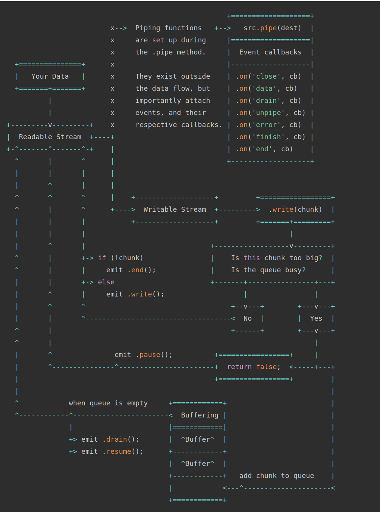
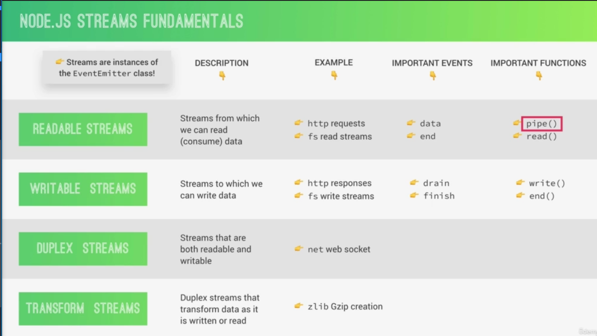

# Streams && Events



# Events

- **close** - emitted after file is written. The 'finish' is emitted when file is written and should be the one monitored.
  - Also emitted when any of its underlying resources like file descriptors have been closed.
  - If the emitClose option is set to true when creating the WriteStream then the close event will be emitted.
- **data** - when data 'chunk' is ready to write.
- **drain** - emitted when buffer is empty and ready for new data.
  - writing to disk is slower than reading, so backpressure will build.
  - when `data buffer highWaterMark` (default is: 16kb for createWriteStream) is reached, the .write() function will return `false`.
- **end** - write process is done.
- **error** - error when piping data
  - `autoDestroy: true`, closes write stream when error emitted.
- **finish** - after the `stream.end` function is called all data has been written.
- **open** - emitted when stream is opened. 'fd' (file descriptor) is passed when with the open event.
- **pipe** - emitted when the `stream.pipe` function is called with a readable stream piped to it.
  - The file specified when creating the ReadStream must exist before piping from it.
- **ready** - emitted when `WriteStream` is ready to be used. Fired after immediately after open event.
- **unpipe** - emitted when the `stream.unpipe` function is called on the readable stream.
  - It’s also emitted when the WriteStream emits an error event when a ReadStreanm is piped to it.

**custom emitter**

```ts
import EventEmitter from "events";

class Sales extends EventEmitter {
  constructor() {
    super();
  }
}

// create event
const myEmitter = new Sales();
// setup listener
myEmitter.on("newSale", () => {
  console.log("New Sale is happening now!");
});

// setup listener
myEmitter.on("newSale", () => {
  console.log("another new sale!");
});

// listener with argument
myEmitter.on("newSale", (stock, greeting) => {
  console.log(stock, greeting);
});
// broadcast event
myEmitter.emit("newSale", 9, "hello"); // 9, hello are the arguments that will be passed.
```

# Streams

**4 stream types**

1. Readable Streams
   1. main events: `data, end`
   2. main methods: `pipe(), read()`
2. Writeable Streams
   1. main events: `drain, finish`
   2. main methods: `write(), end()`
3. Duplex Streams
4. Transform Streams
   
